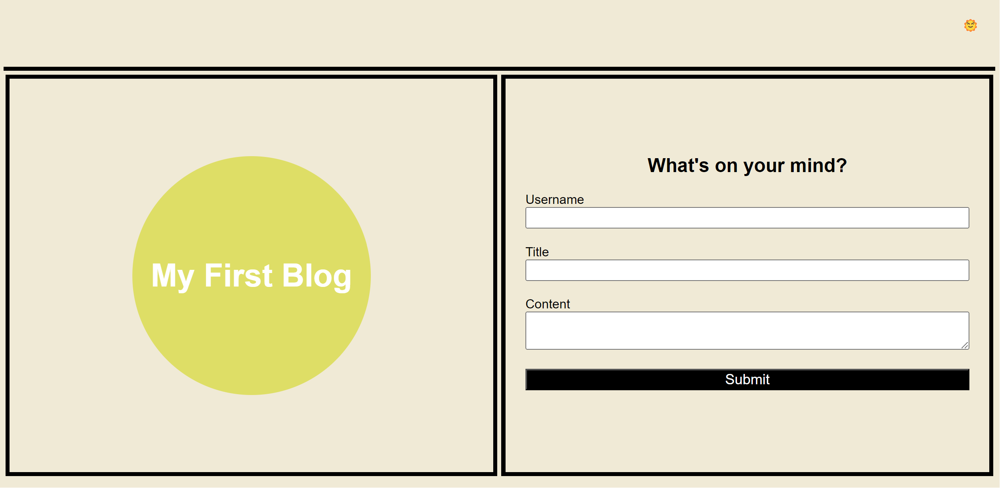
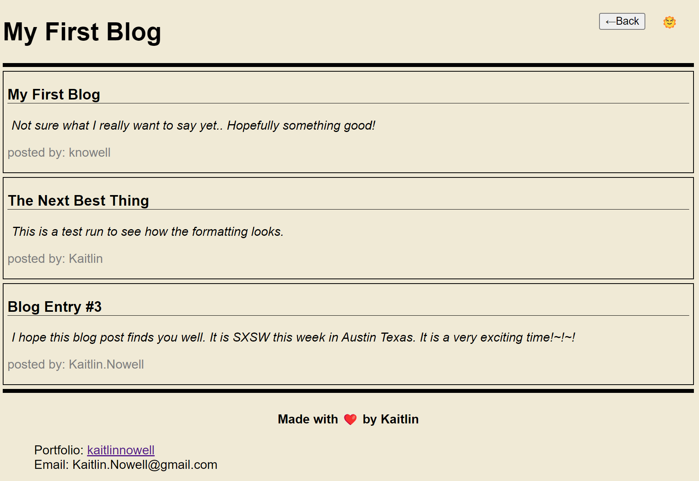
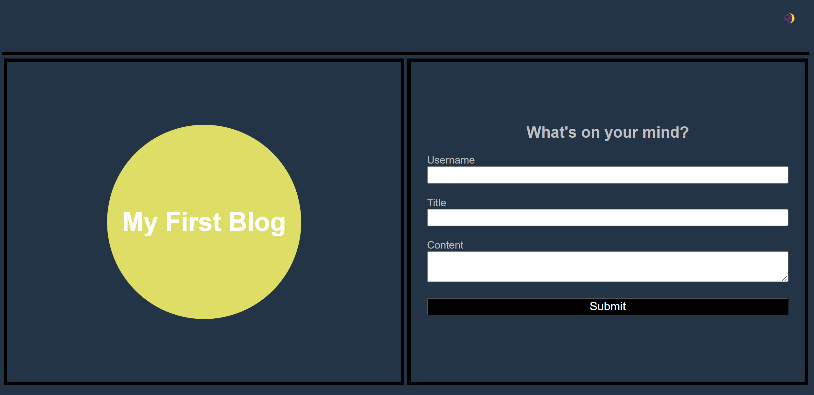

# personal-blog
This application allows the user to create and maintain a personal blog.

Built Application: https://kaitlinnowell.github.io/personal-blog/

The application conatins a form that allows the user to submit new blog posts:

Once Submitted the user is brought to the blog, where all previously submitted posts are displayed.

The application also contains a light/dark mode setting which can be controlled by clicking the sun/moon icons in the top right of the application.

